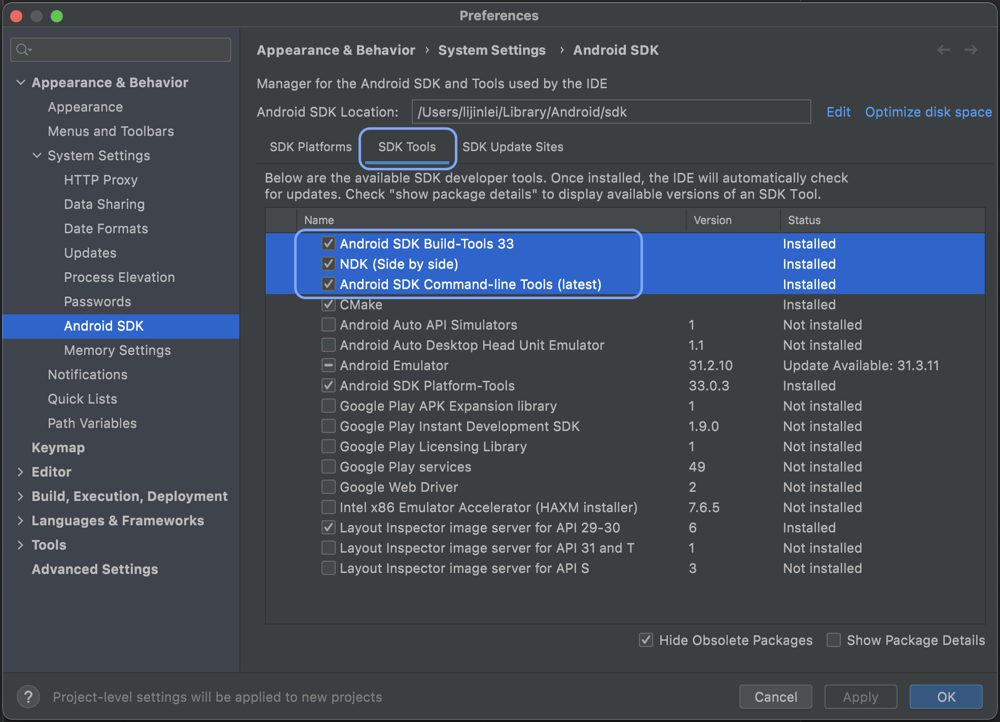
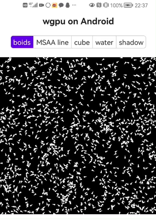

# 与 Android App 集成

## 开发环境配置
假设你的电脑上已经安装了 Android Studio，从菜单栏打开 SDK 管理器（`Tools` > `SDK Manager` > `Android SDK` > `SDK Tools`），勾选以下 3 个选项后点击 `OK` 按钮确认:
- Android SDK Build-Tools
- Android SDK Command-line Tools
- NDK(Side by side)



然后，设置如下两个系统环境变量：

```sh
export ANDROID_SDK_ROOT=$HOME/Library/Android/sdk
# 注意，此处需要替换为你电脑上安装的 NDK 的版本号
export NDK_HOME=$ANDROID_SDK_ROOT/ndk/23.1.7779620
```

## 添加安卓构建目标支持

到目前为止，Android 模拟器和虚拟设备还不支持 Vulkan 图形 API（仅支持 OpenGL ES），所以开发或调试 wgpu 程序在 Android 系统上的运行时，建议使用真机（各种云测平台的云真机也行）。

如果需要支持模拟器运行，还得加上 `x86_64-linux-android` 和 `i686-linux-android` 这两个构建目标的支持。需要注意的是，如果指定了 wgpu 项目使用 Vulkan 图形后端（`Instance::new(wgpu::Backends::VULKAN)`），则在模拟内运行时会崩溃：

```sh
rustup target add aarch64-linux-android armv7-linux-androideabi
```

## 自定义窗口对象

要实现一个 wgpu 里能使用的窗口对象，就必须实现 raw-window-handle 中 `raw_window_handle()` `raw_display_handle()` 这两个分别定义在 `HasRawWindowHandle` `HasRawDisplayHandle` trait 里的抽象接口。

实现 `raw_display_handle()` 最为简单, 只需要实例化一个空的 `AndroidDisplayHandle` 对象做为参数。查看 raw-window-handle 的源码就会发现，实现 `raw_window_handle()` 抽象接口需要用到 [AndroidNdkWindowHandle](https://github.com/rust-windowing/raw-window-handle/blob/master/src/android.rs) 对象，此对象有一个叫 `a_native_window` 的字段，用来指向安卓 App 的 `ANativeWindow` 实例。
下面我们来一步步实现它。

先给项目添加必要的依赖：
```toml
[target.'cfg(target_os = "android")'.dependencies]
jni = "0.19"
# 星号表示不锁定特定版本，在项目构建及运行时始终保持使用最新版本
ndk-sys = "*"
raw-window-handle = "0.5"
```

然后定义一个 `NativeWindow` 结构体，它只有一个叫 `a_native_window` 的字段：

```rust
struct NativeWindow {
    a_native_window: *mut ndk_sys::ANativeWindow,
}
impl NativeWindow {
    // env 和 surface 都是安卓端传递过来的参数
    fn new(env: *mut JNIEnv, surface: jobject) -> Self {
        let a_native_window = unsafe {
            // 获取与安卓端 surface 对象关联的 ANativeWindow，以便能通过 Rust 与之交互。
            // 此函数在返回 ANativeWindow 的同时会自动将其引用计数 +1，以防止该对象在安卓端被意外释放。
            ndk_sys::ANativeWindow_fromSurface(env as *mut _, surface as *mut _)
        };
        Self { a_native_window }
    }
}
```

最后给 `NativeWindow` 实现 raw-window-handle 抽象接口：
```rust
unsafe impl HasRawWindowHandle for NativeWindow {
    fn raw_window_handle(&self) -> RawWindowHandle {
        let mut handle = AndroidNdkWindowHandle::empty();
        handle.a_native_window = self.a_native_window as *mut _ as *mut c_void;
        RawWindowHandle::AndroidNdk(handle)
    }
}

unsafe impl HasRawDisplayHandle for NativeWindow {
    fn raw_display_handle(&self) -> RawDisplayHandle {
        RawDisplayHandle::Android(AndroidDisplayHandle::empty())
    }
}
```

<div class="auto-github-link">
    <a href="https://github.com/jinleili/wgpu-on-app/blob/d28fb4790c12282b135c9776c30bf07c8da40be9/app-surface/src/android.rs#L58-L101" target="_blank" rel="noopener noreferrer">
        查看自定义窗口对象的完整源码！
    </a>
</div>

## 定义 FFI

Rust 有一个关键字 `extern`（kotlin 中定义 JNI 函数时也有一个对应的关键字叫 `external`, 我们接下来会用到），当需要与其他语言编写的代码进行交互时，用于创建和使用**外部函数接口**（FFI，Foreign Function Interface）。FFI 是一种编程语言定义函数的方式，可以让不同的（外部）编程语言调用这些函数。

在 Rust 这一端，我们通过给公开函数添加 `#[no_mangle]` 属性来允许安卓端调用此函数：

```rust
#[no_mangle]
#[jni_fn("name.jinleili.wgpu.RustBridge")]
pub fn createWgpuCanvas(env: *mut JNIEnv, _: JClass, surface: jobject, idx: jint) -> jlong {
    android_logger::init_once(Config::default().with_min_level(Level::Trace));
    let canvas = WgpuCanvas::new(AppSurface::new(env as *mut _, surface), idx as i32);
    info!("WgpuCanvas created!");
    // 使用 Box 对 Rust 对象进行装箱操作。
    // 我们无法将 Rust 对象直接传递给外部语言，通过装箱来传递此对象的裸指针 
    // into_raw 返回指针的同时，也将此对象的内存管理权转交给调用方
    Box::into_raw(Box::new(canvas)) as jlong
}

#[no_mangle]
#[jni_fn("name.jinleili.wgpu.RustBridge")]
pub fn enterFrame(_env: *mut JNIEnv, _: JClass, obj: jlong) {
    // 直接获取到指针指代的 Rust 对象的可变借用
    let obj = unsafe { &mut *(obj as *mut WgpuCanvas) };
    obj.enter_frame();
}
```

<div class="note">

`#[no_mangle]` 属性告诉 Rust 关闭函数名称修改功能。如果不加这个属性，Rust 编译器就会修改函数名，这是现代编译器为了解决唯⼀名称解析引起的各种问题所引⼊的技术。如果函数名被修改了，外部编程语言就⽆法按原名称调⽤，开发者也没办法知道修改后的函数名。

</div>

`#[jni_fn("XXX")]` 这个函数签名属性需要重点介绍一下，做过安卓 JNI 开发的都知道，JNI 函数的签名是又臭又长，比如上面的 `createWgpuCanvas` 函数，手写符合 JNI 规范的函数签名就会是 `Java_name_jinleili_wgpu_RustBridge_createWgpuCanvas` 这样，难写且难维护 `#[jni_fn("name.jinleili.wgpu.RustBridge")]` 这个属性能自动帮我们生成兼容 JNI 的函数签名，使正确编写函数签名变得更加容易。为此，我们需要 jni_fn 依赖项：
```toml
[target.'cfg(target_os = "android")'.dependencies]
jni_fn = "0.1"
# 其它依赖项
```

在安卓端，我们定义一个命名空间为 `name.jinleili.wgpu` 的 `RustBridge` 类来加载 Rust 程序，并使用 `external` 关键字标记好具体实现在 Rust 端的外部函数声明：

```kotlin
package name.jinleili.wgpu

import android.view.Surface

class RustBridge {
    init {
        System.loadLibrary("wgpu_on_app")
    }

    external fun createWgpuCanvas(surface: Surface, idx: Int): Long
    external fun enterFrame(rustObj: Long)
    // ...
}
```

<div class="note">

你可以使用任意符合安卓规范的命名空间，只需要记得让 Rust 端 `#[jni_fn("")]` 属性里的字符串与安卓端代码里的命名空间一致。

</div>

## 实现 cargo so 子命令
实现 `so` 子命令的目的是为了一劳永逸地解决 Rust 项目配置 Android NDK 链接的问题。如果你对如何给 wgpu 项目手动配置 NDK 感兴趣，Mozilla 的[这篇文章](https://mozilla.github.io/firefox-browser-architecture/experiments/2017-09-21-rust-on-android.html)有详细的步骤。 `so` 子命令的代码非常简单，而且我已经将它发布到了 Rust 的包注册网站 [crates.io](https://crates.io), 可以直接安装使用：

```rust
let args = std::env::args();
match Subcommand::new(args, "so", |_, _| Ok(false)) {
    Ok(cmd) => match cmd.cmd() {
        "build" | "b" => {
            let ndk = Ndk::from_env().unwrap();
            let build_targets = if let Some(target) = cmd.target() {
                vec![Target::from_rust_triple(target).ok().unwrap()]
            } else {
                vec![
                    Target::Arm64V8a,
                    Target::ArmV7a,
                    Target::X86,
                    Target::X86_64,
                ]
            };
            for target in build_targets {
                let triple = target.rust_triple();
                // setting ar, linker value
                let mut cargo = cargo_ndk(&ndk, target, 24).unwrap();
                cargo.arg("rustc");
                if cmd.target().is_none() {
                    cargo.arg("--target").arg(triple);
                }
                cargo.args(cmd.args());
                if ndk.build_tag() > 7272597 {
                    if !cmd.args().contains(&"--".to_owned()) {
                        cargo.arg("--");
                    }
                    let gcc_link_dir = cmd.target_dir().join("gcc-temp-extra-link-libraries");
                    let _ = std::fs::create_dir_all(&gcc_link_dir);
                    std::fs::write(gcc_link_dir.join("libgcc.a"), "INPUT(-lunwind)")
                        .expect("Failed to write");
                    cargo.arg("-L").arg(gcc_link_dir);
                }

                if !cargo.status().unwrap().success() {
                    println!("{:?}", NdkError::CmdFailed(cargo));
                }
            }
        }
        _ => {}
    },
    Err(_) => {}
};
``` 

<div class="auto-github-link">
    <a href="https://github.com/jinleili/wgpu-on-app/tree/master/cargo-so" target="_blank" rel="noopener noreferrer">
        查看 cargo-so 源码！
    </a>
</div>

## 编译为 .so 库文件
首先，安装我们上面实现 `so` 子命令:
```sh
# 从 crates.io 安装
cargo install cargo-so
# 或者
# 也可以从源码安装
cargo install --path ./cargo-so
```

然后，使用 `so` 子命令来构建 wgpu 项目：
```sh
# 将 wgpu 程序构建为 Android .so 库文件
cargo so b --lib --target aarch64-linux-android --release
cargo so b --lib --target armv7-linux-androideabi --release

# 将 .so 复制到安卓项目的 jniLibs/ 目录下
cp target/aarch64-linux-android/release/libwgpu_on_app.so android/app/libs/arm64-v8a/libwgpu_on_app.so
cp target/armv7-linux-androideabi/release/libwgpu_on_app.so android/app/libs/armeabi-v7a/libwgpu_on_app.so
```

我们还可以上面的构建与复制命令放进一个 `.sh` 命令行文件内，之后编译项目时只需要执行此命令行文件就可以了：
```sh
sh ./release.sh
``` 


## 自定义 WGPUSurfaceView

安卓视图组件 `SurfaceView` 提供了一个可嵌入在视图层级结构中的专用于绘制的视图。它负责**绘制表面**（Surface）在屏幕上的正确位置，还控制着绘制表面的像素格式及分辨率大小。
`SurfaceView` 持有的**绘制表面**是独立于 App 窗口的，可以在单独的线程中进行绘制而不占用主线程资源。所以使用 `SurfaceView` 可以实现复杂而高效的渲染（比如，游戏、视频播放、相机预览等），且不会阻塞用户交互（触摸、键盘输入等）的响应。

安卓系统上的**绘制表面**是纵深排序（Z-Ordered）的，它默认处在 App 窗口的后面， `SurfaceView` 通过在 App 窗口上面设置透明区域来展示处在后面的绘制表面。
如果想将绘制表面放置到窗口的最上层，可以通过 `setZOrderOnTop()` 函数来实现：

```kotlin
mySurfaceView.setZOrderOnTop(true)
```

<div class="note">

这里有必要多解释一句：wgpu 里的 `Surface` 对象虽然最终指向的就是 SurfaceView 持有的`绘制表面`，但它是一个经过统一封装的结构体，所以并不是同一个对象：

```rust
pub struct Surface {
    pub(crate) presentation: Option<Presentation>,
    #[cfg(vulkan)]
    pub vulkan: Option<HalSurface<hal::api::Vulkan>>,
    #[cfg(metal)]
    pub metal: Option<HalSurface<hal::api::Metal>>,
    #[cfg(dx12)]
    pub dx12: Option<HalSurface<hal::api::Dx12>>,
    #[cfg(dx11)]
    pub dx11: Option<HalSurface<hal::api::Dx11>>,
    #[cfg(gl)]
    pub gl: Option<HalSurface<hal::api::Gles>>,
}
```

</div>

窗口的视图层级结构决定了与`绘制表面`的正确合成，也就是说，绘制表面的展示会受到视图层级关系的影响，在 `SurfaceView` 所处层级之上的视图会覆盖（遮挡）在合成后的绘制表面之上。
需要注意的是，如果覆盖内容存在透明度，则每次绘制表面渲染完成后，都会进行一次完整的 `alpha` 混合合成，这会对性能产生不利影响。

我们只能通过 `SurfaceHolder` 接口来访问绘制表面。当 `SurfaceView` 在窗口中可见时，绘制表面就会被创建，而不可见时（比如，App 被切换到后台运行）绘制表面会被销毁，所以需要实现 `SurfaceHolder` 的回调接口 `surfaceCreated` 及 `surfaceDestroyed` 来发现绘制表面的创建和销毁。
下边的代码实现了一个继承自 `SurfaceView` 的 `WGPUSurfaceView`：

```kotlin
// 为当前类实现 SurfaceHolder 的回调接口
class WGPUSurfaceView : SurfaceView, SurfaceHolder.Callback2 {
    private var rustBrige = RustBridge()
    // Rust 对象的指针
    private var wgpuObj: Long = Long.MAX_VALUE
    private var idx: Int = 0

    //...

    init {
        // 将当前类设置为 SurfaceHolder 的回调接口代理
        holder.addCallback(this)
    }

    // 绘制表面被创建后，创建/重新创建 wgpu 对象
    override fun surfaceCreated(holder: SurfaceHolder) {
        holder.let { h ->
            wgpuObj = rustBrige.createWgpuCanvas(h.surface, this.idx)
            // SurfaceView 默认不会自动开始绘制，setWillNotDraw(false) 用于通知 App 已经准备好开始绘制了。
            setWillNotDraw(false)
        }
    }

    // 绘制表面被销毁后，也销毁 wgpu 对象
    override fun surfaceDestroyed(holder: SurfaceHolder) {
        if (wgpuObj != Long.MAX_VALUE) {
            rustBrige.dropWgpuCanvas(wgpuObj)
            wgpuObj = Long.MAX_VALUE
        }
    }

    override fun draw(canvas: Canvas?) {
        super.draw(canvas)
        // 考虑到边界情况，这个条件判断不能省略
        if (wgpuObj == Long.MAX_VALUE) {
            return
        }
        rustBrige.enterFrame(wgpuObj)
        // invalidate() 函数通知通知 App，在下一个 UI 刷新周期重新调用 draw() 函数 
        invalidate()
    }
}
```


## App 中加载 WGPUSurfaceView
现在可以在 Activity 或 Fragment（此处仅指安卓 Fragment，与着色器里的**片元**无关）里加载 `WGPUSurfaceView` 实例了，通过 XML 或者 Java/Kotlin 代码来加载很常见，下面我们来看看在安卓上的新一代 UI 开发框架 [Jetpack Compose](https://developer.android.com/jetpack/compose) 中如何加载：

```kotlin
class MainActivity : ComponentActivity() {
    override fun onCreate(savedInstanceState: Bundle?) {
        super.onCreate(savedInstanceState)

        setContent {
            MyApplicationTheme {
                Surface(
                    modifier = Modifier.fillMaxSize(),
                    color = colorResource(id = R.color.white)
                ) {
                    SurfaceCard()
                }
            }
        }
    }
}

@Composable
fun SurfaceCard() {
    val screenWidth = LocalConfiguration.current.screenWidthDp.dp
    Column(modifier = Modifier.fillMaxSize()) {
        Row(
            verticalAlignment = Alignment.CenterVertically,
            horizontalArrangement = Arrangement.Center
        ) {
            Text(text = "wgpu on Android", fontSize = 20.sp, fontWeight = FontWeight.Bold)
        }
        // ...

        // 通过 AndroidView 容器来加载我们的 WGPUSurfaceView
        AndroidView(
            factory = { ctx ->
                WGPUSurfaceView(context = ctx)
            },
            modifier = Modifier
                .fillMaxWidth()
                .height(screenWidth),
        )
    }
}
```

基于以上代码，我写了一个叫 wgpu-on-app 的示例程序，效果如下：



<div class="github-link">
    <a href="https://github.com/jinleili/wgpu-on-app" target="_blank" rel="noopener noreferrer">
        查看 wgpu-on-app 完整项目源码！
    </a>
</div>