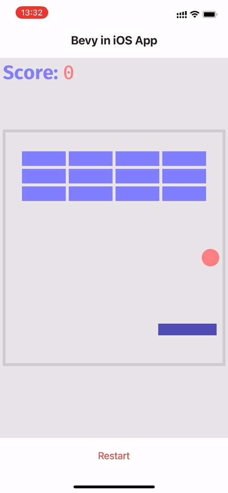

# 在 iOS Android App 中集成 Bevy 游戏引擎

## 认识 Bevy

**Bevy** 是一个开源、跨平台的 Rust 游戏引擎，设计目的是提供一个简单、高效且易于使用的游戏开发框架。它的特点包括：

- 模块化设计：游戏引擎的各个组件皆为单独的模块，方便选择需要的组件并扩展。
- 灵活的插件系统：支持自定义插件，可以创建并集成自己的插件。
- 易于使用的 API：API 简单易懂，帮助快速开始游戏开发。
- 强大的渲染系统：使用了 wgpu 作为渲染后端，以提供强大的图形渲染能力。
- 跨平台：除了支持在 Windows、MacOS 和 Linux 桌面系统及 iOS、Android 移动设备上运行，还能在支持 WebGPU 的浏览器上运行。

Bevy 是一个适合新手的游戏引擎，其简单性和灵活性使得能够轻松地开始游戏开发，随着经验的增加，它也能满足更高级的定制需求。

## 需求场景

如果需要给已有的 App 添加一个开屏小游戏，或者实现一些动态 UI 组件、图表...，又或者只是想充分利用手机上的 Motion Sensors 来实现令人惊艳的游戏体验，那么就不能使用 Bevy 默认的 `WinitPlugin` 了。因为 `winit` 会完全控制 App 的初始化过程和窗口，而我们需要的是在已有的 App 实例中创建 `bevy::App`， 并且我们可能还希望 `bevy::App` 能在任意大小的 iOS `UIView` 或 Android `SurfaceView` 中运行。

本章我们将逐步实现一个此类场景，并且利用手机的 Motion Sensor 来玩 breakout 小游戏。

## Bevy 中的窗口插件

Bevy 中有两个窗口插件：`WindowPlugin` 与 `WinitPlugin`。

`WindowPlugin` 是 Bevy 中构建游戏或应用程序的基础插件, 它提供了一套简单易用的接口来管理窗口的属性（标题、是否可见...）、行为（获取焦点，缩放约束，窗口显示层级...）、与事件（鼠标、键盘、触摸事件...）。**`WindowPlugin` 并不负责实际的窗口创建，它需要与其他插件配合使用**。

`WinitPlugin` 为 Bevy 提供实际的窗口及事件循环的创建与管理。顾名思义，它依赖了 winit 窗口管理库。

下面通过源码来看看 `WinitPlugin` 是如何完成工作的:

```rust
// crates/bevy_winit/src/lib.rs

#[derive(Default)]
pub struct WinitPlugin;

impl Plugin for WinitPlugin {
    fn build(&self, app: &mut App) {
        let mut event_loop_builder = EventLoopBuilder::<()>::with_user_event();
        let event_loop = event_loop_builder.build();
        app.insert_non_send_resource(event_loop);

        app.init_non_send_resource::<WinitWindows>()
            .init_resource::<WinitSettings>()
            .set_runner(winit_runner)
            .add_systems(...);
        // ...
    }
}
```

`WinitPlugin` 是个实现了 `Plugin` trait 的空结构体，在 build 函数内向 app `World` 内添分别加了 `EventLoop`，`WinitWindows`，`WinitSettings` 3 项资源，`WinitWindows` 用于随后创建并保存窗口实例：

```rust
// crates/bevy_winit/src/winit_windows.rs

#[derive(Debug, Default)]
pub struct WinitWindows {
    pub windows: HashMap<winit::window::WindowId, winit::window::Window>,
    // ...
}
```

然后, 设置了一个叫 `winit_runner` 的 runner 函数，这个函数在用户调用 `app.run()` 时会被自动执行。

`winit_runner()` 内调用了 `create_window()` 来完成最终的窗口创建：

```rust
// crates/bevy_winit/src/lib.rs

pub fn winit_runner(mut app: App) {
    // 取出在 build() 中创建的事件循环实例
    let mut event_loop = app
        .world
        .remove_non_send_resource::<EventLoop<()>>()
        .unwrap();

    // 创建一个新的系统状态
    let mut create_window_system_state: SystemState<(Commands, Query<(Entity, &mut Window),
    Added<Window>>, EventWriter<WindowCreated>,NonSendMut<WinitWindows>)>
        = SystemState::from_world(&mut app.world);

    let event_handler = move |event: Event<()>,
                              event_loop: &EventLoopWindowTarget<()>,
                              control_flow: &mut ControlFlow| {
        // ...
        // 创建新窗口
        let (commands, mut new_windows, created_window_writer, winit_windows) =
                create_window_system_state.get_mut(&mut app.world);
        create_window(
            commands,
            event_loop,
            new_windows.iter_mut(),
            created_window_writer,
            winit_windows,
            ...
        );
        // ...
    ｝
}

// crates/bevy_winit/src/system.rs

pub(crate) fn create_window<'a>(
    mut commands: Commands,
    event_loop: &EventLoopWindowTarget<()>,
    created_windows: impl Iterator<Item = (Entity, Mut<'a, Window>)>,
    mut event_writer: EventWriter<WindowCreated>,
    mut winit_windows: NonSendMut<WinitWindows>,
) {
    for (entity, mut window) in created_windows {
        // ...
        // 创建 winit 窗口
        let winit_window = winit_windows.create_window(event_loop, entity, &window);
        // 更新 bevy 窗口的状态
        window.resolution.XXX;
        // ...
    }
}
```

## 实现 AppViewPlugin

接下来要做的就是使用自定义的窗口插件来替代 `WinitPlugin`。具体怎么做呢？简单模仿 `WinitPlugin` ！

首先，需要实现一个创建与保存窗口实例的结构体。由于我们的宿主 App 已经有完整的事件循环了，创建及管理事件循环的步骤都可以免了：

```rust
// bevy_in_app/src/app_view/app_views.rs

#[derive(Debug, Default)]
pub struct AppViews {
    views: HashMap<WindowId, AppView>,
    entity_to_window_id: HashMap<Entity, super::WindowId>,
}

impl AppViews {
    pub fn create_window(
        &mut self,
        #[cfg(target_os = "ios")] view_obj: super::IOSViewObj,
        #[cfg(target_os = "android")] view_obj: super::AndroidViewObj,
        entity: Entity,
    ) -> Window { ... }
}
```

`AppViews` 里的 `AppView`、`IOSViewObj`、`AndroidViewObj` 在前面的[与 iOS App 集成](../ios/#定义-ffi)及[与 Android App 集成](../android/#自定义窗口对象)分别有详细介绍，简单来讲，`IOSViewObj` 封装了 iOS `UIView` 实例，`AndroidViewObj` 封装了 Android `SurfaceView` 所持有的 `ANativeWindow` 实例，AppView 实现了 `HasRawWindowHandle` 与 `HasRawDisplayHandle` trait。

```rust
// bevy-in-app/src/app_view/mod.rs

pub struct AppViewPlugin;

impl Plugin for AppViewPlugin {
    fn build(&self, app: &mut App) {
        app.init_non_send_resource::<AppViews>().add_systems(
            (
                changed_window.ambiguous_with(exit_on_all_closed),
                despawn_window.after(changed_window),
            )
                .in_base_set(CoreSet::Last),
        );
    }
}
```

上面就是 `AppViewPlugin` 的完整代码，就这么简单。

值得注意的是，在 `build()` 中没有像 `WinitPlugin` 一样设置 `runner` 函数，这是怎么回事？

前面已经提到，设置的 `runner` 函数会在调用 `app.run()` 时被自动执行。查看源码可以到此函数会将 app 实例从内存中移出并传递 `runner`，用户端的 `app` 被替换成了空实例：

```rust
// crates/bevy_app/src/app.rs

pub fn run(&mut self) {
	// ...
	let mut app = core::mem::replace(self, App::empty());
	let runner = core::mem::replace(&mut app.runner, Box::new(run_once));

	(runner)(app);
}
```

我们需要从宿主 App 事件循环中调用 Bevy `App` 实例，所以不能让 `runner` 拿走它，改由从 `src/ffi/create_bevy_app()` 函数中手动调用：

```rust
// bevy-in-app/src/ffi/iOS.rs

#[no_mangle]
pub fn create_bevy_app(view: *mut objc::runtime::Object, scale_factor: f32) -> *mut libc::c_void {
    let mut bevy_app = crate::create_breakout_app();
    let ios_obj = IOSViewObj { view, scale_factor };
    bevy_app.insert_non_send_resource(ios_obj);

    create_bevy_window(&mut bevy_app);
    // ...
}

// bevy-in-app/src/app_view/mod.rs

pub fn create_bevy_window(app: &mut App) {
    #[cfg(target_os = "ios")]
    let view_obj = app.world.remove_non_send_resource::<IOSViewObj>().unwrap();
    #[cfg(target_os = "android")]
    let view_obj = app.world.remove_non_send_resource::<AndroidViewObj>().unwrap();

    let mut create_window_system_state: SystemState<(
        Commands,
        Query<(Entity, &mut Window), Added<Window>>,
        EventWriter<WindowCreated>,
        NonSendMut<AppViews>,
    )> = SystemState::from_world(&mut app.world);
    let (mut commands, mut new_windows, mut created_window_writer, mut app_views) =
        create_window_system_state.get_mut(&mut app.world);

    for (entity, mut bevy_window) in new_windows.iter_mut() {
        if app_views.get_view(entity).is_some() {
            continue;
        }
        let app_view = app_views.create_window(view_obj, entity);
        let logical_res = app_view.logical_resolution();

        bevy_window
            .resolution
            .set_scale_factor(app_view.scale_factor as f64);
        bevy_window.resolution.set(logical_res.0, logical_res.1);

        commands.entity(entity).insert(RawHandleWrapper {
            window_handle: app_view.raw_window_handle(),
            display_handle: app_view.raw_display_handle(),
        });

        created_window_writer.send(WindowCreated { window: entity });
    }
    create_window_system_state.apply(&mut app.world);
}
```

`create_bevy_window` 函数的完整执行逻辑如下: 0. 从 `World` 中取出 `IOSViewObj` 或 `AndroidViewObj` 目标平台的视图对象资源;

1. 创建一个新的系统状态，并获取所需的命令队列，窗口实体列表，**窗口创建写入器**（EventWriter\<WindowCreated\>）和 `AppViews` 的可变借用;
2. 遍历窗口实体列表，检查窗口是否已经被创建;
3. 调用 `AppViews` 的 `create_window()` 创建一个新窗口 `app_view`（也就是实现了 `raw-window-handle` traits 的 `AppView`）;
4. 调用 `app_view` 的相关函数与字段更新 Bevy window 的物理分辨率缩放因子及逻辑分辨率;
5. 通过命令队列 `commands` 将 `app_view` 中实现的窗口句柄插入到实体中;
6. **窗口创建写入器**发送一个包含了新窗口的实体的 `WindowCreated`;
7. 最后，调用 `apply()` 函数应用系统状态;

`IOSViewObj` 与 `AndroidViewObj` 遵循了 Bevy 中资源传递的惯例，在 `create_bevy_app()` FFI 函数中调用 `insert_non_send_resource()` 将其插入到 `World`。
此处没使用 `insert_resource()` 有两个原因：

- `IOSViewObj` 不是线程安全的，iOS UIView 中的函数只能在主线程中使用;
```shell
error[E0277]: `*mut Object` cannot be sent between threads safely
  --> src/app_view/ios.rs:21:26
   |
21 | #[derive(Debug, Default, Resource)]
   |                          ^^^^^^^^ `*mut Object` cannot be sent between threads safely
   |
   = help: the trait `Send` is not implemented for `*mut Object`
   = note: required for `Option<*mut Object>` to implement `Sync`
```
- 事实上也并不需要在多线程环境中来创建窗口;

## 链接 `libc++` 库
实现了 `AppViewPlugin` 后运行 `cargo so b --lib --target aarch64-linux-android` 将 crate 编译为 `.so` 库文件，在 Android 项目中加载时将得到如下错误：

```shell
dlopen failed: cannot locate symbol "__gxx_personality_v0" referenced by ...
```
我们知道 Bevy 项目通过 `cargo-apk` 命令编译为 `.apk` 是可以在 Android 上安装运行的，于是查看 [cargo-apk](https://github.com/rust-mobile/cargo-apk) 的源码：

```rust
self.add_lib(&artifact, target)?;
for need in list_needed_libs(&readelf_path, &artifact)? {
	// c++_shared is available in the NDK but not on-device.
	// Must be bundled with the apk if used:
	// https://developer.android.com/ndk/guides/cpp-support#libc
	let search_paths = if need == "libc++_shared.so" {
		// ...
	}
	// ...
}
```

根据注释里的[相关链接](https://developer.android.com/ndk/guides/cpp-support#libc)及 `libc++_shared` 链接库名称，就知道如何在我们的项目里链接 Android libc++ 共享库了, 在 `android.rs` 中添加如下代码：

```rust
// bevy-in-app/src/ffi/android.rs

#[link(name = "c++_shared")]
extern "C" {}
```

编译后运行, 现在出现了新的情况：

```sh
dlopen failed: library "libc++_shared.so" not found
```

有两个解决途径：
- 从 GitHub 下载编译好的 `libc++_shared.so` 放到 `jniLibs/XX` 目录下; 
- 使用 `externalNativeBuild` 配置一个空的 c++ 原生库的构建, Gradle 会自动将该库添加到 App 中;

[bevy-in-app](https://github.com/jinleili/bevy-in-app) 使用了第二种方式，仅需一点模板化的配置，可以直接查看项目源码，这里就不贴出来了。

## 调用 Motion Sensors
以 Android 为例：
```kotlin
class BevySurfaceView : SurfaceView, SurfaceHolder.Callback2 {
    private var sensorManager: SensorManager? = null
    private var mSensor: Sensor? = null
    private var sensorValues: FloatArray = FloatArray(3)

    constructor(context: Context) : super(context) {
        // 获取传感器服务
        sensorManager = context.getSystemService(Context.SENSOR_SERVICE) as SensorManager
        // 获取重力传感器，用于检测设备的重力变化
        mSensor = sensorManager?.getDefaultSensor(Sensor.TYPE_GRAVITY)
    }

    override fun surfaceCreated(holder: SurfaceHolder) {
        holder.let { h ->
            // ...
            // 创建了一个传感器事件监听器
            var sensorEventListener = object : SensorEventListener {
                // 当传感器的值改变时，更新 sensorValues 变量的值
                override fun onSensorChanged(event: SensorEvent?) {
                    if (event != null) {
                        sensorValues = event.values
                    }
                }
                override fun onAccuracyChanged(sensor: Sensor?, accuracy: Int) {
                }
            }
            mSensor?.also { sensor ->
                // 注册上边创建的事件监听器，以便开始监听传感器事件
                sensorManager?.registerListener(sensorEventListener, sensor, SensorManager.SENSOR_DELAY_GAME)
            }
        }
    }
}
```

现在已经有了实时变化的传感器数据，仅需调用 Rust 端实现的 FFI 函数来发送此**输入事件**。

Android 端：

```kotlin
override fun draw(canvas: Canvas?) {
    // ...
    bevyApp.device_motion(bevy_app, sensorValues[0], sensorValues[1], sensorValues[2])
    bevyApp.enter_frame(bevy_app)
    // invalidate() 函数通知通知 App，在下一个 UI 刷新周期重新调用 draw() 函数
    invalidate()
}
```

Rust 端：
```rust
// bevy-in-app/src/ffi/android.rs

#[no_mangle]
#[jni_fn("name.jinleili.bevy.RustBridge")]
pub fn device_motion(_env: *mut JNIEnv, _: jobject, obj: jlong, x: jfloat, _y: jfloat, _z: jfloat) {
    let app = unsafe { &mut *(obj as *mut App) };
    let x: f32 = x as _;
    if x < -0.2 {
        crate::change_input(app, KeyCode::Left, ButtonState::Released);
        crate::change_input(app, KeyCode::Right, ButtonState::Pressed);
    } else if x > 0.2 {
        crate::change_input(app, KeyCode::Right, ButtonState::Released);
        crate::change_input(app, KeyCode::Left, ButtonState::Pressed);
    } else {
        crate::change_input(app, KeyCode::Left, ButtonState::Released);
        crate::change_input(app, KeyCode::Right, ButtonState::Released);
    }
}

// bevy-in-app/src/lib.rs

#[cfg(any(target_os = "android", target_os = "ios"))]
pub(crate) fn change_input(app: &mut App, key_code: KeyCode, state: ButtonState) {
    let input = KeyboardInput {
        scan_code: if key_code == KeyCode::Left { 123 } else { 124 },
        state,
        key_code: Some(key_code),
    };
    app.world.cell().send_event(input);
}
```

## 如何重启/退出 Bevy 引擎
Bevy 引擎默认的行为是，当所有窗口关闭时自动退出。显然，这不能满足当前的场景，因为我们需要在不销毁 iOS `UIView` 或 Android `SurfaceView` 的情况下原地重启 Bevy `App`。
为此，需要自定义一个退出函数，以确保在需要的时候可以手动退出：
```rust
// bevy-in-app/src/lib.rs

#[cfg(any(target_os = "android", target_os = "ios"))]
pub(crate) fn exit_bevy_app(mut app: Box<App>) {
    // 创建一个查询所有窗口的状态变量
    let mut windows_state: SystemState<(Commands, Query<(Entity, &mut Window)>)> =
        SystemState::from_world(&mut app.world);
    // 获取命令列表与窗口列表的可变借用
    let (mut commands, windows) = windows_state.get_mut(&mut app.world);
    // 遍历并提交所有窗口实体的销毁命令
    for (window, _focus) in windows.iter() {
        commands.entity(window).despawn();
    }
    windows_state.apply(&mut app.world);
    // 由于我们没有使用 Bevy App 的 runner 函数，需要手动 update
    app.update();
}
```


## 运行

<div style="display: flex;">
    <div>
        
    </div>
    <div style="width: 20px;"></div>
    <div>
        
    </div>
</div>

<div class="github-link">
    <a href="https://github.com/jinleili/bevy-in-app" target="_blank" rel="noopener noreferrer">
        查看 bevy-in-app 完整项目源码！
    </a>
</div>
