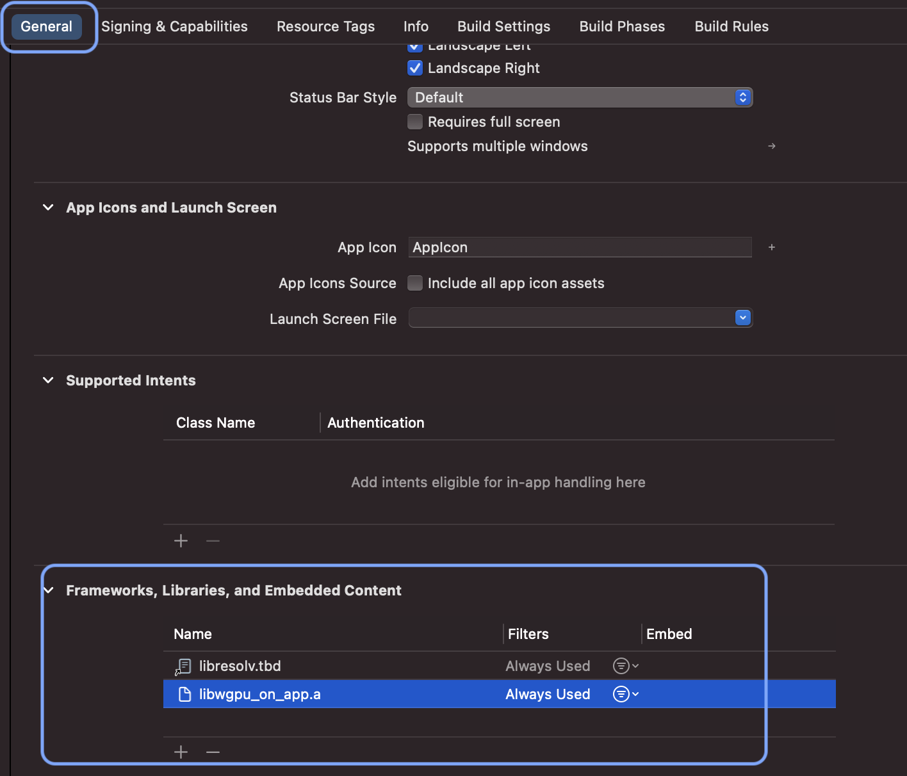
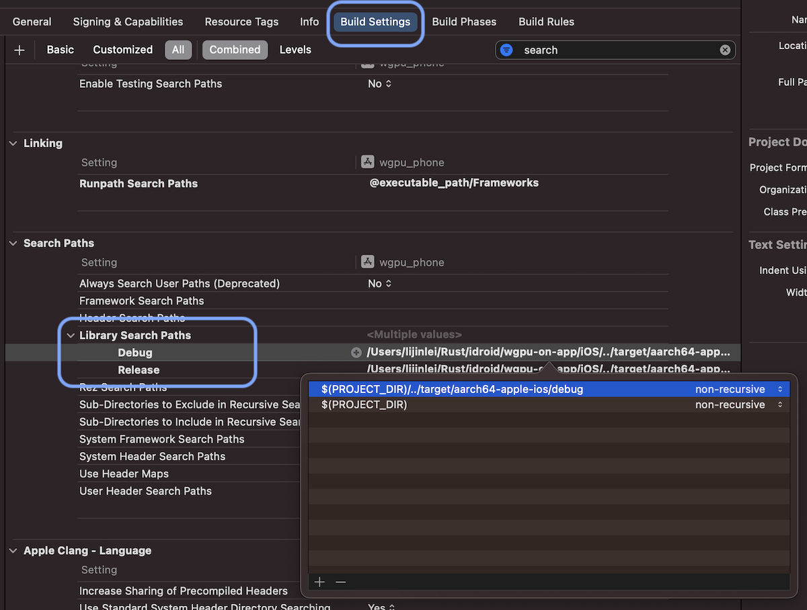

# 与 iOS App 集成

与 iOS App 集成相比于 Android 要简单一些。

## 添加 iOS 构建目标支持
```sh
# 添加 iOS 构建目标支持
rustup target add aarch64-apple-ios 

# 添加 iOS 模拟器构建目标支持
# Intel CPU Mac
rustup target add x86_64-apple-ios
# M1+ Mac
rustup target add aarch64-apple-ios-sim
```

由于从 A7 芯片（iPhone 5S，iPad Mini 2） 开始，iPhone iPad 都是 64 位的设备，所以我们不需要 `armv7s-apple-ios`、 `armv7-apple-ios` 这两个构建目标。

<div class="note">

#### iOS 模拟器相比于真机设备的特殊之处
当运行 WebGPU 程序时，**模拟器**并不会试图完全模拟你正在模拟的 iOS 设备的 GPU。例如，如果选择 iPhone 14 Pro 模拟器，它不会试图模拟 A16 GPU 的能力。相反，模拟器会翻译你的任何调用，并将它们引导到 Mac 主机上的选定 GPU。

苹果为**模拟器**单独提供了一个设备对象，其功能被限制为苹果 GPU 家族的 Apple2 型号（也就是古早的 A8 芯片），这意味着模拟器往往比实际的 GPU 支持更少的功能或更多的限制。从[这篇文档](https://developer.apple.com/documentation/metal/developing_metal_apps_that_run_in_simulator) 可以查看到功能限制的详情。

开发调试 GPU 应用，使用真机永远是最好的选择。

</div>

## 定义 FFI

在 iOS/macOS 上，使用 `CAMetalLayer` 也能创建**绘制表面**的实例，所以我们无须去实现 [raw-window-handle](https://github.com/rust-windowing/raw-window-handle) 抽象接口。

先给项目添加上必要的依赖：

```toml
[target.'cfg(target_os = "ios")'.dependencies]
libc = "*"
objc = "0.2.7"
```

然后定义一个 `IOSViewObj` 结构体:

```rust
#[repr(C)]
pub struct IOSViewObj {
    // metal_layer 所在的 UIView 容器
    // UIView 有一系列方便的函数可供我们在 Rust 端来调用
    pub view: *mut Object,
    // 指向 iOS 端 CAMetalLayer 的指针
    pub metal_layer: *mut c_void,
    // 不同的 iOS 设备支持不同的屏幕刷新率，有时我们的 GPU 程序需要用到这类信息
    pub maximum_frames: i32,
    // 外部函数接口，用于给 iOS 端传递状态码
    pub callback_to_swift: extern "C" fn(arg: i32),
}
```
`#[repr(C)]` 属性标注 `IOSViewObj` 的内存布局兼容 C-ABI。

<div class="note">

#### 什么是 ABI？
ABI 是⼀个规范，它涵盖以下内容：
· 调⽤约定。⼀个函数的调⽤过程本质就是参数、函数、返回值如何传递。编译器按照调⽤规则去编译，把数据放到相应的堆栈中，函数的调⽤⽅和被调⽤⽅（函数本⾝）都需要遵循这个统⼀的约定。
· 内存布局。主要是⼤⼩和对齐⽅式。 
· 处理器指令集。
· ⽬标⽂件和库的⼆进制格式。

#### 为什么使用 C-ABI？
不同的操作系统、编程语⾔、每种编程语⾔的不同编译器 实现基本都有⾃⼰规定或者遵循的 ABI 和调⽤规范。⽬前只能通过 FFI 技术遵循 C 语⾔ ABI 才可以做到编程语⾔的相互调⽤。也就是说，**C-ABI** 是唯⼀通⽤的稳定的标准 ABI。这是由历史原因决定的，C 语⾔伴随着操作系 统⼀路发展⽽来，导致其成为事实上的标准 ABI。

</div>

假设我们已经实现好了一个 wgpu 程序叫 WgpuCanvas, 现在来实现两个供 iOS 端调用的、控制 WgpuCanvas 初始化及帧渲染的函数:

```rust
#[no_mangle]
pub fn create_wgpu_canvas(ios_obj: IOSViewObj) -> *mut libc::c_void {
    let obj = WgpuCanvas::new(AppSurface::new(ios_obj), 0_i32);
    // 使用 Box 对 Rust 对象进行装箱操作。
    // 我们无法将 Rust 对象直接传递给外部语言，通过装箱来传递此对象的裸指针 
    let box_obj = Box::new(obj);
    Box::into_raw(box_obj) as *mut libc::c_void
}

#[no_mangle]
pub fn enter_frame(obj: *mut libc::c_void) {
    // 将指针转换为其指代的实际 Rust 对象，同时也拿回此对象的内存管理权
    // from_raw 是 unsafe 函数，它的调用需要放在 unsafe {} 块中
    let mut obj: Box<WgpuCanvas> = unsafe { Box::from_raw(obj as *mut _) };
    obj.enter_frame();
    // 将 obj 对象的内存管理权重新转交给调用方
    Box::into_raw(obj);
}
```

`#[no_mangle]` 属性告诉 Rust 关闭函数名称修改功能。如果不加这个属性，Rust 编译器就会修改函数名，这是现代编译器为了解决唯⼀名称解析引起的各种问题所引⼊的技术。如果函数名被修改了，外部编程语言就⽆法按原名称调⽤，开发者也没办法知道修改后的函数名。

你应该已注意到了，上面的 `enter_frame(obj: *mut libc::c_void)` 函数里，我们做了两次内存管理权的转移，先是取回了内存管理权，后又再次转交给调用方。有没有办法避免这两次转移来提升性能呢？可以，直接从裸指针获取到对象的可变借用：

```rust 
#[no_mangle]
pub fn enter_frame(obj: *mut libc::c_void) {
    // 直接获取到指针指代的 Rust 对象的可变借用
    let obj = unsafe { &mut *(obj as *mut WgpuCanvas) };
    obj.enter_frame();
}
```

<div class="note">

#### Unsafe Rust
Unsafe Rust 是 Safe Rust 的⼀个超集。也就是说，在 `unsafe {}` 块中，并不会禁⽤ Safe Rust 中的任何安全检查。它仅在进⾏以下五类操作时，不提供安全检查：
- **裸指针**的解引⽤或类型转换;
- 调⽤ unsafe 的函数; 
- 访问或修改可变静态变量; 
- 实现 unsafe trait;
- 读写 Union 联合体中的字段;

`&mut *(obj as *mut WgpuCanvas)` 之所以要放在 `unsafe {}` 块中，不仅仅是由于 `obj` 参数是**裸指针**，还因为 Rust 在编译阶段的静态安全检查此时完全没有⽤武之地，所以也就没必要提供安全检查了。

</div>

还需要写一个简单的 C 语言的头文件来对应上面定义的结构体与函数。
让我们按照惯例，使用项目编译出来的 `.a` 库文件名称为此头文件命名：

```c

#ifndef libwgpu_on_app_h
#define libwgpu_on_app_h

#include <stdint.h>

// 这个不透明结构体用来指代 Rust 端的 WgpuCanvas 对象
struct wgpu_canvas;

// 对应 Rust 端的 IOSViewObj 对象
struct ios_view_obj {
    void *view;
    // CAMetalLayer
    void *metal_layer;
    int maximum_frames;
    void (*callback_to_swift)(int32_t arg);
};

struct wgpu_canvas *create_wgpu_canvas(struct ios_view_obj object);
void enter_frame(struct wgpu_canvas *data);

#endif /* libwgpu_on_app_h */
```

将上面的头文件放置到 iOS 项目中。如果你的 iOS 项目是使用 Swift 创建的，则还需要将头文件引入到**桥接文件**（XXX-Bridging-Header.h）中：

```c
#ifndef wgpu_test_Bridging_Header_h
#define wgpu_test_Bridging_Header_h

#import "libwgpu_on_app.h"

#endif /* wgpu_test_Bridging_Header_h */
```

## App 中加载 WgpuCanvas 对象

先在 iOS 项目中自定义一个继承自 UIView 的 `MetalView`，代码很简单：

```swift
class MetalView: UIView {
    // 这里将 View 的默认 Layer 指定为 CAMetalLayer
    override class var layerClass: AnyClass {
        return CAMetalLayer.self
    }
    
    override func awakeFromNib() {
        super.awakeFromNib()
        configLayer()
    }
    
    private func configLayer() {
        guard let layer = self.layer as? CAMetalLayer else {
            return
        }
        layer.presentsWithTransaction = false
        layer.framebufferOnly = true
        // nativeScale is real physical pixel scale
        // https://tomisacat.xyz/tech/2017/06/17/scale-nativescale-contentsscale.html
        self.contentScaleFactor = UIScreen.main.nativeScale
    }
}
```

然后在 ViewController 中实例化 WgpuCanvas：

```swift
// ...
// 我是通过 StoryBoard 绑定的 MetalView，当然，你也可以手动创建
@IBOutlet var metalV: MetalView!
// 指向 Rust 端 WgpuCanvas 的指针
var wgpuCanvas: OpaquePointer?
lazy var displayLink: CADisplayLink = {
    CADisplayLink.init(target: self, selector: #selector(enterFrame))
}()
// ...
override func viewDidAppear(_ animated: Bool) {
    super.viewDidAppear(animated)
    // 我们需要保证 WgpuCanvas 只被实例化一次
    if wgpuCanvas == nil {
        // 将 Swift 对象转换为裸指针
        let viewPointer = Unmanaged.passRetained(self.metalV).toOpaque()
        let metalLayer = Unmanaged.passRetained(self.metalV.layer).toOpaque()
        let maximumFrames = UIScreen.main.maximumFramesPerSecond
        
        // 创建 IOSViewObj 实例
        let viewObj = ios_view_obj(view: viewPointer, metal_layer: metalLayer,maximum_frames: Int32(maximumFrames), callback_to_swift: callback_to_swift)
        // 创建 WgpuCanvas 实例
        wgpuCanvas = create_wgpu_canvas(viewObj)
    }
    self.displayLink.isPaused = false
}

@objc func enterFrame() {
    guard let canvas = self.wgpuCanvas else {
        return
    }
    // 执行 WgpuCanvas 帧渲染
    enter_frame(canvas)
}

func callback_to_swift(arg: Int32) {
    // callback_to_swift 函数是在 WgpuCanvas 中被调用的，WgpuCanvas 的代码很可能没有运行在 iOS 的 UI 线程，
    // 如果此处涉及到 UI 操作，就必须切换到 UI 线程。
    DispatchQueue.main.async {
        switch arg {
        // ...
        }
    }
}
```

## 编译与运行

```sh
# 编译为 iOS 真机支持的库
# debug 库
cargo build --target aarch64-apple-ios
# release 库
cargo build --target aarch64-apple-ios --release

# 编译为 iOS 模拟器支持的库
# M1+ Mac 上执行：
cargo build --target aarch64-apple-ios-sim 
# Intel 芯片的 Mac 上执行：
cargo build --target x86_64-apple-ios

# 编译成功后需复制文件libwgpu_in_app.a至项目目录下
# cp target/${TARGET}/${LIB_FOLDER}/libwgpu_in_app.a Apple/libs/${LIB_FOLDER}/libwgpu_in_app.a
```

打开 iOS 项目，在项目的 `General` 选项卡下找到 `Frameworks, Libraries, and Embedded Content` 栏, 导入系统的 `libresolv.tbd` 及我们刚编译的 `.a` 库，此导入只需要操作一次：



然后在 `Build Settings` 选项卡下找到 `Search Paths` -> `Library Search Paths` 栏， 将 `.a` 库的 debug 和 release 路径填到对应的字段中:



最后，还是在 `Build Settings` 选项卡下，找到 `Linking` -> `Other Linker Flags` 栏，添加 `-ObjC`、`-lc++` 两个链接标记：


<div class="note">

当 Xcode 版本 >= 13 且 `iOS Deployment Target` >= 12.0 时，`Other Linker Flags` 栏的设置可以省略。

</div>

以上就是所有的关键代码和步骤了，我写了一个叫 wgpu-in-app 的示例程序，效果如下：


<div class="github-link">
    <a href="https://github.com/jinleili/wgpu-in-app" target="_blank" rel="noopener noreferrer">
        查看 wgpu-in-app 完整项目源码！
    </a>
</div>
