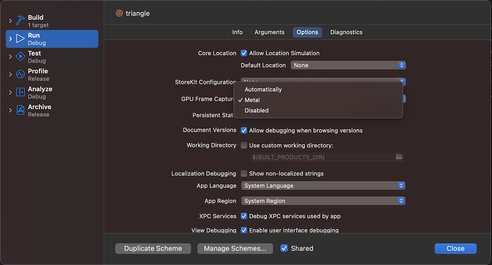
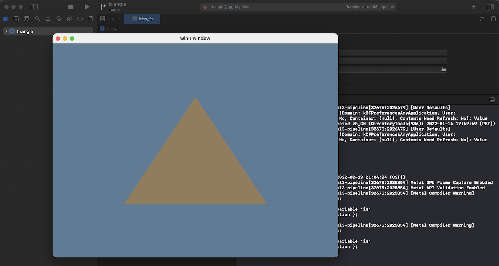

# 使用 Xcode 调试 wgpu 程序

## Xcode 与 Metal
**Xcode** 是苹果官方提供的运行在 macOS 系统上的 **IDE**，它提供了一整套工具来方便为苹果设备（比如，iPad、iPhone、Mac 等等）创建、测试、优化 App 并最终发布到 App Store。Xcode 是免费的，如果你使用的是 macOS 系统，就可以从 [App Store](https://apps.apple.com/cn/app/xcode/id497799835?mt=12) 上下载安装。

**Metal** 是 wgpu 在苹果平台上使用的图形后端，Metal **框架**（Framework）通过提供低开销的底层 GPU 编程 API、图形和计算管线之间的紧密集成以及一套强大的 GPU 分析和调试工具，为苹果平台上的图形硬件加速提供动力。

2014 年，苹果在**全球开发者大会** (WWDC) 上宣布为 iOS 推出全新的 Metal 框架，
一年后的 WWDC 2015，苹果宣布了 macOS 上也将支持 Metal，随后是 watchOS 和 tvOS。 随着 Metal API 的不断发展，在 WWDC 2017 上推出了新版本，**Metal 2**。它增加了对虚拟现实 (VR)、增强现实 (AR) 和机器学习 (ML) 的支持，以及其它许多新功能. 

今年（WWDC 2022）推出的 **Metal 3**，引入了更为强大的功能，能帮助游戏和专业应用程序充分挖掘苹果芯片的潜力：借助高性能放大和**抗锯齿**（anti-aliasing）功能，能在更短的时间内渲染高分辨率的图形; 使用异步 I/O 将资源数据直接从存储优化流式传输到 Metal 纹理和缓冲区，能更快地加载资源; 新的**光线追踪**（Metal Ray Tracing）构建加速结构所花费的 GPU 时间更少，可以通过将**剔除**（Culling）工作转移到 GPU 以减少 CPU 开销，并且通过直接访问原始数据来优化光线求交和着色; 还有机器学习加速及新的**网格着色器**（Mesh Shader）等等。


## 创建调试项目
首先，我们打开 Xcode，使用菜单或启动对话框中的 `Create a new Xcode project` 来创建一个新项目（左图），然后单击 `Other` 选项卡, 选中**外部构建系统**（External Build System）作为项目模板（右图）:
<div style="display: flex;">
    <div>
        
    </div>
    <div style="width: 20px;"></div>
    <div>
        
    </div>
</div>


然后，在**构建工具**（Build Tool）字段中填入要使用的构建工具，Xcode 在运行项目时，将会调用此处设置的构建工具。
如果希望 Xcode 运行 cargo 构建命令，就可以填写 cargo 在你的 macOS 上的安装路径（默认的路径是 `${HOME}/.cargo/bin/cargo`），也可以留空来表示跳过构建步骤，以避免 Xcode 为我们构建项目。

其余的字段实际上对我们来说并不重要，因此可以随意填，但**产品名称**（Product Name）字段还是尽量填一个有意义的名称吧：


## 编辑 Scheme
接着编辑项目的**方案**（Scheme）来启用 Metal 的 GPU **帧捕获**（Frame Capture）及  **接口验证**（API Validation）工具集。
通常，如果 Xcode 项目里的代码调用了 Metal 框架或任何其他使用了 Metal API 的框架，Xcode 会自动启用 GPU 帧捕获 和 Metal 接口验证，但我们的这个项目使用的是**外部构建系统**（External Build System），只能手动设置。

手动设置其实非常简单：

1，单击项目名称，然后单击 `Edit Scheme`（左图）（或者，从顶部菜单栏上选择 `Product` -> `Scheme` -> `Edit Scheme`）;

2，在弹出的**方案**功能面板中选中左边栏的 `Run`，将右边的功能配置表切换至 `Options` 选项卡，设置 `GPU Frame Capture` 栏为 `Metal` 来启用 GPU 帧捕获（右图）;

<div class="note">

##### `GPU Frame Capture` 栏三个选项的详细说明：
- Automatically：自动捕获项目中的 Metal 或 OpenGL ES API 使用情况。如果项目未链接到 Metal 或 OpenGL ES 框架，则 `Capture GPU Frame` 按钮不会显示在调试栏中。如果项目同时使用 Metal 和 OpenGL ES API，则可以单击并按住 `Capture GPU Frame` 按钮来选择要捕获的 API;
- Metal：仅捕获项目中的 Metal API 使用情况;
- Disabled：禁用 GPU 帧捕获功能;

</div>

<div style="display: flex;">
    <div>
        
    </div>
    <div style="width: 20px;"></div>
    <div>
        
    </div>
</div>

3，在 `Info` 选项卡下的 `executable` 栏（左图），我们来指定要运行的可执行文件：单击可选项里的 `Other`，然后在目标目录中找到由 cargo 创建的二进制文件（右图）。
<div style="display: flex;">
    <div>
        
    </div>
    <div style="width: 20px;"></div>
    <div>
        
    </div>
</div>


<div class="note">

##### 如何找到 cargo 创建的二进制可执行文件？
我们以[管线](../../beginner/tutorial3-pipeline/)教程的示例代码为例，先在项目根目录（learn-wgpu-zh/）运行管线示例：

`cargo run --bin tutorial3-pipeline` 

然后在 learn-wgpu-zh/target/debug/ 路径下你就能找到一个名为 `tutorial3-pipeline` 的可执行文件。

</div>

接下来，点击 `Start` 按钮，Xcode 就能运行我们指定的二进制文件了：
        


你应该能看三角形绘制程序正在运行，并且 Xcode 控制台的一些输出告诉我们已启用了 Metal 接口验证：



## 查看实时 GPU 统计数据
仅需点击 `Start` 按钮运行我们要调试的程序，然后将 Xcode 左边栏切换至**调试导航栏**（Debug Navigator，通常 Xcode 会在调试项目启动时自动跳转到调试导航栏), 就能查看到实时的内存、CPU 占用及**帧率**（FPS）等，选中每一栏还可查看详情，以**帧率**栏为例，详情内还提供了 CPU 与 GPU 的每帧耗时，GPU **顶点**与**片元**运算单元的利用率等信息，方便我们诊断出程序的性能瓶颈之所在：


## GPU 帧捕获

要启动 Metal 的**调试器**（Debugger)，在点击 `Start` 按钮运行程序之后，需再点击 Xcode **调试区**（Debug Area）工具栏的 `Capture GPU Frame` 按钮（上面有个 Metal 图标的按钮）。
捕获一帧之后，我们就能够使用所有常规的 Metal 调试工具（例如 GPU 统计、着色器及缓冲区调试等）了：


## 调试帧数据
我们以 [Uniform 缓冲区](../../beginner/tutorial6-uniforms/) 教程的示例为例来调试 Uniform **缓冲区**中的数据: 捕获一帧之后，在**调试导航栏**选择 `Render Pass` 下的 `All Resources` 项，右边的列表里将会列出当前程序使用到的各种资源（纹理，缓冲区等）（左图），双击 `Camera Buffer` 就能格式化展示此缓冲区的数据了，同时数据展示区的下边会多出来一栏工具，方便我们切换数据的**格式化**类型及展示列数等（右图）。
<div style="display: flex;">
    <div>
        
    </div>
    <div style="width: 20px;"></div>
    <div>
        
    </div>
</div>

<div class="note">

##### 不知你有没有注意到
左侧的**调试导航栏**中的 Render Pass 及右侧资源列表里展示的名称（如，Camera Buffer）都是我们在代码里设置的 labal 参数：

```rust 
let mut render_pass = encoder.begin_render_pass(&wgpu::RenderPassDescriptor {
    label: Some("Render Pass"),
    // ...
};
// ...
let camera_buffer = device.create_buffer_init(&wgpu::util::BufferInitDescriptor {
    label: Some("Camera Buffer"),
    // ...
});
```
</div>
