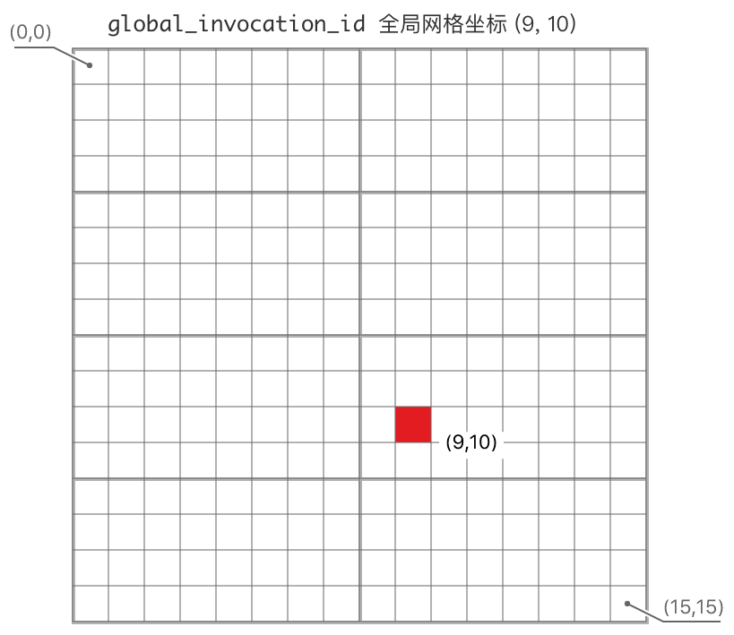

# 计算管线

**计算管线**（`ComputePipeline`）是 WebGPU 中控制**计算着色器**（Compute Shader）阶段的管线。

计算管线适用于各种 GPU 通用计算场景，这是 WebGL 所不具备的。我们通过绑定的**存储缓冲区**（Storage Buffer）及**存储纹理**（Storage Texture）来获得计算输出。

## 创建一个计算管线

计算管线的创建相比于**渲染管线**简单得多，甚至我们都不需要显式创建并指定**绑定组布局**（BindGroupLayout）：

```rust
let compute_shader = device.create_shader_module(...);
let compute_pipeline = device
    .create_compute_pipeline(&wgpu::ComputePipelineDescriptor {
        layout: None, // 此处使用了隐式布局
        module: &compute_shader,
        entry_point: "cs_main",
        compilation_options: Default::default(),
        label: None,
    });
```

<div class="warning">

使用隐式绑定组布局有一个小小的局限：绑定的每个资源必须在**入口点**（Entry Point）中有被访问到。如果有没被访问的绑定资源，就必须显式指定布局。

</div>

## 使用存储缓冲区与存储纹理

**存储缓冲区**与**存储纹理**都是 WGSL 中的资源类型。

而我们在 wgpu 中创建及绑定它们时，与其它缓冲区及纹理的创建是一样的，只需要在 `usage` 字段中标记出用途：

```rust
let buf = device.create_buffer_init(&wgpu::util::BufferInitDescriptor {
        // ...
        // VERTEX | STORAGE 表示此缓冲区可以做为顶点缓冲区以及存储缓冲区来使用
        usage: BufferUsages::VERTEX | BufferUsages::STORAGE,
    });

let tex = app.device.create_texture(&wgpu::TextureDescriptor {
        // ...
        // TEXTURE_BINDING | STORAGE_BINDING 表示此纹理可以做为采样纹理以及存储纹理来使用
        usage: TextureUsages::TEXTURE_BINDING | TextureUsages::STORAGE_BINDING,
    });
```

在 WGSL 中，**存储缓冲区**与**存储纹理**有一些使用上的区别：

- **存储缓冲区**：默认访问模式是**只读**，可以通过 `read_write` 声明为可读可写, 读写操作类似于数组的访问与赋值;
- **存储纹理**：默认访问模式是**只写**，而且在 Web 端只能用**只写**模式，在 Native 端我们可以使用 `TEXTURE_ADAPTER_SPECIFIC_FORMAT_FEATURES` feature 来打开可读可写的访问模式。还有，存储纹理必须明确声明纹素的格式，且不支持带 `Srgb` 后缀的格式。从这里可以查阅到所有受支持的格式： [WGSL 标准：存储纹素格式](https://gpuweb.github.io/gpuweb/wgsl/#storage-texel-formats)

```rust
struct Particle {
  pos : vec2f,
  vel : vec2f,
};
// 存储缓冲区
@group(0) @binding(0) var<storage, read_write> particles: array<Particle>;
@group(0) @binding(1) var from_tex: texture_2d<f32>;
// 存储纹理
@group(0) @binding(2) var to_tex: texture_storage_2d<rgba8unorm, write>;

@compute @workgroup_size(16, 16)
fn cs_main(@builtin(global_invocation_id) global_id: vec3<u32>) {
    let uv = vec2<i32>(global_id.xy);
    // 读取存储缓冲区
    let particle = particles[vu.x * uv.y];

    var texel: vec4f;
    // ...
    // 写入纹素数据到存储纹理
    textureStore(to_tex, uv, texel);
}
```

## 计算通道

与创建**渲染通道**类似，我们需要使用 `encoder` 来创建**计算通道**（`ComputePass`），然后用**计算通道**来编码所有的计算**命令**：

```rust
// let encoder = ...
{
    let mut cpass = encoder.begin_compute_pass(&ComputePassDescriptor::default());
    cpass.set_pipeline(&self.compute_pipeline);
    cpass.set_bind_group(0, &self.bind_group, &[]);
    cpass.dispatch_workgroups(self.workgroup_count.0, self.workgroup_count.1, 1);
}
queue.submit(iter::once(encoder.finish()));
```

在[展示平面](../../beginner/tutorial2-surface/#渲染)章节已讲解过 `{}` 开辟块空间的用途，这里就不再赘述。

`dispatch_workgroups()` 就是调度计算任务的命令，接受 3 个 `u32` 类型的值做为参数。这些参数具体是什么意思呢？那就要说到计算管线里最重要的一个概念了：

## 工作组

GPU 通过同时运行大量线程来实现并行处理的能力，而**工作组**（Workgroup）就是用于指定 GPU 如何组织这些线程。<br />
一个**工作组**实质上就是一组调用，同一工作组中的线程同时分别执行一个**计算着色器**实例，并共享对工作组地址空间中着色器变量的访问。计算着色器通常被设计成线程相互独立运行，但线程在其工作组上进行协作也很常见。

可以将**工作组**理解为一个三维网格，网格中的每个点就代表一个线程。在图像处理中，网格通常是一个二维的线程矩阵（二维就是其中一个维度为 1 的特殊三维形式），代表整个图像，每个线程对应于正在处理的图像的一个像素。

我们通过（x, y, z）三个维度来声明计算着色器的**工作组**大小，每个维度上的默认值都是 1：

```rust
@workgroup_size(32, 16) // x = 32, y = 16, z = 1
```

下图显示了正在被着色器处理的图像如何被划分为工作组，以及每个工作组是如何由单个线程组成：


那么，线程与工作组在计算着色器网格中的位置是如何被标识的呢？

### 内建输入量

WGSL 计算着色器有 5 个**内建输入量**（Buit-in Input Values）用于标识当前线程及工作组：

- `global_invocation_id`：当前线程在计算着色器网格中的全局三维坐标;
- `local_invocation_id`：当前线程在所处的工作组中的局部三维坐标;
- `local_invocation_index`：当前线程在所处的工作组中的线性化索引;
- `workgroup_id`：当前工作组在工作组网格中的三维坐标;
- `num_workgroups`：当前**调度**（dispatch）的工作组维度量;

最常用的是前三个**内建输入量**。

例如，给定一个由 `16 * 16 * 1` 个线程组成的网格，将其划分为 `2 * 4 * 1` 个工作组，`8 * 4 * 1` 个线程。
那么:

- 一个线程在网格中的 `global_invocation_id` 全局三维坐标是 `(9, 10)`（左图）;
- 此线程在所处工作组中的 `local_invocation_id` 局部三维坐标是 `(1, 2)`， `local_invocation_index` 线性化索引是 `17`（右图）;
- 所处工作组在工作组网格中的 `workgroup_id` 三维坐标就是 `(1, 2)` （右图的蓝绿色块）：

<div style="display: flex;">
    <div>
        
    </div>
    <div style="width: 20px;"></div>
    <div>
        
    </div>
</div>

这些内建输入量在着色器中具体如何使用呢？下边的着色器中演示了如何直接通过 `global_invocation_id` 来获取纹素的坐标：

```rust
struct UniformParams {
  img_size: vec2<i32>,
  uv_offset: vec2<i32>,
};
@group(0) @binding(0) var<uniform> params: UniformParams;
@group(0) @binding(1) var from_tex: texture_2d<f32>;

@compute @workgroup_size(16, 16)
fn cs_main(@builtin(global_invocation_id) global_id: vec3<u32>) {
  // 纹素（图片的像素）坐标
  let uv = vec2<i32>(global_id.xy);
  // 判断当前坐标是否超出了纹素坐标范围
  if (uv.x >= params.img_size.x || uv.y >= params.img_size.y) {
    return;
  }

  // 从纹理图像中读取纹素
  var texel = textureLoad(from_tex, uv, 0)
  // ...
}
```

<div class="warn">

使用计算着色器需要注意避免坐标越界问题，因为通常纹理图像的分辨率与我们的**工作组**大小不是整除关系。

</div>

### 确定工作组大小与数量

**工作组**的最佳大小（指 x, y, z 三个维度的大小）并没有固定的值，需要结合实际使用场景来确定，而且能支持的最大值还与目标硬件有关。

我们从 [adapter.limits()](https://gpuweb.github.io/gpuweb/#limits) 里，能获取到当前设备支持的最大工作组大小 `(maxComputeWorkgroupSizeX，maxComputeWorkgroupSizeY，maxComputeWorkgroupSizeZ)`，它们的默认值分别为 `(256, 256, 64)`。

<div class="warn">

这三个维度的最大值容易让人误解，以为可以在计算着色器中设置 `@workgroup_size(256, 256, 64)`。

事实上 WebGPU spec 的验证规则是：`x * y * z <= max(x, max(y, z))`, 也就是说，设置的
`@workgroup_size` 三个维度的乘积不能大于 `maxComputeWorkgroupSizeX，Y，Z` 三个维度中的最大值。

</div>

通常，当只需要在计算着色器中操作存储缓冲区时，使用一维工作组 `@workgroup_size(x)` 是合适的, y、z 维度保持默认值 1; 当需要操作**纹理**，使用二维或三维工作组 `@workgroup_size(x，y)` 会更便利。

现在我们可以来回答开头的问题了：<br />

```rust
cpass.dispatch_workgroups(workgroup_count.0, workgroup_count.1, workgroup_count.2);
```

上面计算通道的**调度**命令接收的参数具体是什么意思呢？

它们就是工作组网格的 3 个维度量。<br />
以 `1000 * 768` 个线程组成的网格为例，假设工作组大小为`@workgroup_size(32，16)`，那么:

```rust
// 计算维度值并向上取整
workgroup_count = ((1000 + (32 -1)) / 32, (768 + (16 -1)) / 16, 1);
```

## CPU 端读取计算管线输出

在[案例展示/离屏渲染](../../showcase/windowless/#从缓冲区中读取数据)章节已讲解过如何从缓冲区中读取数据，存储纹理的读取也是一样的，这里不再赘述。

## 实战：实现高斯模糊

要掌握 WebGPU 计算管线，核心内容就是上边讲解的 “使用存储缓冲区与存储纹理” 及 “工作组”，某个具体实现的着色器逻辑代码并不重要，因为它们与顶点及片元着色器代码没有太大的区别。

点击下方的**查看源码**就能看到所有实现代码。如对图片模糊算法的细节感兴趣，可以查看[这里](https://www.intel.com/content/www/us/en/developer/articles/technical/an-investigation-of-fast-real-time-gpu-based-image-blur-algorithms.html)

## 运行示例代码

_此示例可在桌面端及 Chrome / Edge 113+、Arc、Safari 18、Firefox Nightly、Safari Technology Preview 浏览器中运行（[如何开启浏览器 WebGPU 功能支持](../../#如何开启浏览器-webgpu-功能支持))_

<WebGPUExample example="compute_pipeline"></WebGPUExample>

<AutoGithubLink/>
